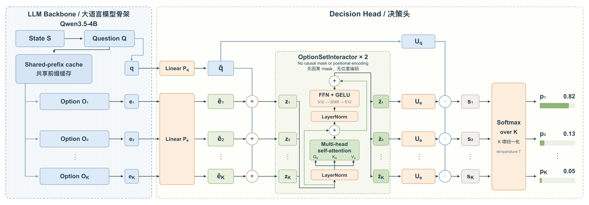

<div align="center">
<h1>OpenJev-4B</h1>
<p><strong>Open-vocabulary decisions. Explicit probabilities.</strong></p>
</div>

## 1. Introduction

**OpenJev-4B** is a decision model built from the text backbone of [Qwen3.5-4B](https://huggingface.co/Qwen/Qwen3.5-4B). Given a **state**, a **question**, and a request-defined set of **natural-language options**, it directly predicts a probability distribution over those options. It supports selection, binary judgments, and rubric-based scoring through the same probabilistic interface.

The model combines a language-model backbone with a lightweight **Option Set Interactor** and a shared decision head. Its output dimension follows the candidate set supplied with each request: option names and optional criteria are inputs, rather than classes fixed in the model parameters. Decision probabilities are computed without autoregressive answer generation.

OpenJev-4B is post-trained in two stages: **supervised fine-tuning (SFT)** followed by **REINFORCE-Analysis (REINFORCE-A)**. SFT establishes decision behavior using predominantly hard labels. RL increases the share of soft-target contexts and refines probability quality through sampled outcome feedback. A fixed subset of SFT contexts is replayed using the same RL objective.

## 2. Model Summary



**Architecture.** OpenJev-4B is designed to combine language understanding with direct, efficient decisions over an open-vocabulary candidate set. It encodes each option independently under the same state and question, then brings the resulting representations together in a lightweight, two-layer **Option Set Interactor**. This lets the model consider semantic relationships between candidates—such as overlap, competition, and statements that refer to other options—before assigning probabilities through a shared decision head. The interactor has no option-position embeddings or causal ordering, and all option branches share their parameters. As a result, the architecture is **permutation equivariant**: reordering the same option objects reorders their output probabilities, up to numerical execution effects. Candidate names and criteria are supplied with each request, so the model is not restricted to a fixed vocabulary of labels. For efficient inference, it computes decision probabilities directly instead of generating answer tokens, supports parallel option-branch computation, and can reuse shared state and question prefixes, including both attention caches and recurrent states in the Qwen3.5 backbone. These choices reduce repeated prefix computation and avoid autoregressive answer decoding while preserving interaction across options.

**Training.** We train both the backbone and the decision head in two stages: **supervised fine-tuning (SFT)** followed by **REINFORCE-Analysis (REINFORCE-A)**. SFT learns the decision distribution from complete targets, with predominantly hard labels establishing broad decision accuracy; RL uses a larger share of soft-target contexts to refine probability quality. Unlike token-generation RL with sequence-level rewards, our RL samples candidate decisions directly from the predicted distribution, mixed with 10% uniform exploration. Each episode draws 16 actions with replacement and receives binary feedback indicating whether each action matches the same hidden outcome. For soft-target examples, that outcome is drawn from the target distribution by the environment; the actor's update uses sampled feedback rather than the complete target. REINFORCE-A combines importance correction and a leave-one-out baseline with an exactly computed probability-based term: only the outcome-dependent part requires sampling. This aims to reduce estimation noise and sampling overhead while improving both decision accuracy and distribution quality. A KL penalty to the frozen SFT reference helps retain learned behavior, without PPO clipping or a learned value head. We also select a fixed 25% of the SFT contexts for replay during RL; these contexts use the same RL objective as all other RL examples. The final stages cover 100,420 unique SFT contexts and 71,498 unique RL contexts including replay, with the share of soft-target contexts rising from 14.3% to 29.8%.

The curated training collection is available as [OpenJevData-140k](https://huggingface.co/datasets/shenjunhao/OpenJevData-140k). See the [training guide](docs/TRAINING.md) for public split counts, replay selection and the exact execution recipe.

## 3. Evaluation Results

The [model card on Hugging Face](https://huggingface.co/shenjunhao/OpenJev-4B#3-evaluation-results) contains the full comparison with Jev, Decider 4B, JevK5 4B and Intern-Decision-4B on MMDM Hard/Soft and JevBench Public, including Accuracy, Brier and scoring details. [MMDM](https://huggingface.co/datasets/shenjunhao/mmdm) provides the evaluation collection.

## 4. Inference

The weights are available at [shenjunhao/OpenJev-4B](https://huggingface.co/shenjunhao/OpenJev-4B). Use this repository's decision runtime to load the backbone and decision head together.

In a CUDA environment with compatible PyTorch (validated: PyTorch 2.11.0+cu129):

```bash
git clone https://github.com/ejhshen/OpenJev.git
cd OpenJev
python -m pip install -e ".[serve]"
python -m pip install fla-core==0.5.2
python examples/infer.py --model shenjunhao/OpenJev-4B
```

The example downloads the model through Hugging Face and executes the request in [examples/decision.json](examples/decision.json). Use `--model /path/to/artifact` for existing local weights. In an already prepared environment, `pip install --no-deps -e .` installs only this repository.

```python
from openjev.runtime.engine import DecisionEngine

engine = DecisionEngine("shenjunhao/OpenJev-4B", execution_mode="expanded")
result = engine.predict({
    "state": "A customer recognizes a purchase but reports being charged twice.",
    "questions": {
        "route": {
            "type": "choice",
            "instructions": "Which team should handle this request?",
            "criteria": {
                "Duplicate payment": "The same purchase was charged more than once.",
                "Unrecognized payment": "The customer does not recognize the purchase."
            }
        }
    }
})
print(result["answers"]["route"]["choice"])
print(result["answers"]["route"]["probabilities"])
```

The output contains the selected candidate and probabilities, not generated reasoning text. The interface also supports `noul` (probability of true) and `score` (an expected rubric-level index). See [the input/output format, shared-prefix mode and HTTP server](docs/INFERENCE.md).

## 5. Training

Both stages are included: full-parameter **SFT → REINFORCE-Analysis**. The code retains the optimized FSDP2 engine, decision-level length packing, cross-rank token balancing, deferred synchronization, FLA gated-delta kernels, token caching and frozen-reference caching.

The [training guide](docs/TRAINING.md) specifies the tested environment and pinned verl utilities. After checking dependencies, initialize from Qwen3.5-4B, prepare the public data and launch the fixed two-stage pipeline:

```bash
bash training/check_imports.sh
hf download Qwen/Qwen3.5-4B --local-dir work/qwen35-base
python -m openjev.cli prepare --model work/qwen35-base --output work/text-backbone
python -m openjev.cli initialize --backbone work/text-backbone \
  --config training/model.json --output work/init
python -m openjev.training.prepare_data \
  --dataset shenjunhao/OpenJevData-140k \
  --mandatory-replay training/mandatory-replay.json --output work/data
NPROC=8 bash training/run_two_stage.sh
```

Each stage uses global batch 1,024; the runner computes its step count from the prepared data. Edit [training/sft.json](training/sft.json) and [training/rl.json](training/rl.json) for paths, microbatch budgets, learning rates and optional dev evaluation. `run_sft.sh` and `run_rl.sh` expose separate launch/resume commands. Checkpoints include optimizer, scheduler and sampling state; the exported artifact is compatible with the inference example.

## Repository Layout

```text
src/openjev/
  models/               # Backbone adapter, serializer, option-set decision head
  runtime/              # Local/Hub loading, prefix reuse and HTTP serving
  api/                  # Choice, Noul and Score request/response format
  training/             # Public data preparation, caches and two-stage runner
  rlcd/                 # REINFORCE-A, outcome feedback and frozen reference cache
  integrations/verl/    # Optimized FSDP2 execution and checkpoints
  data/                 # Validated records, length packing and token cache
training/               # SFT/RL recipes and launch scripts
examples/               # One-request inference example
docs/                   # Architecture image, inference and training guides
tests/                  # Decision behavior and training correctness checks
```

## License and Acknowledgements

[MIT](LICENSE). OpenJev builds on [Qwen3.5](https://huggingface.co/Qwen/Qwen3.5-4B), [Transformers](https://github.com/huggingface/transformers), [verl](https://github.com/volcengine/verl), [verl-agent](https://github.com/langfengQ/verl-agent), and [Flash Linear Attention](https://github.com/fla-org/flash-linear-attention). These projects retain their own licenses. The training launch/check-import/documentation organization also takes inspiration from [Skill-Alpha](https://github.com/ejhshen/skill-alpha).
